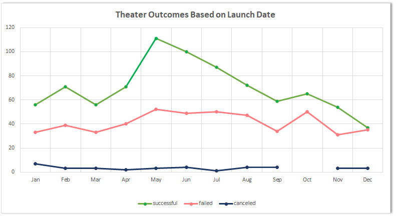
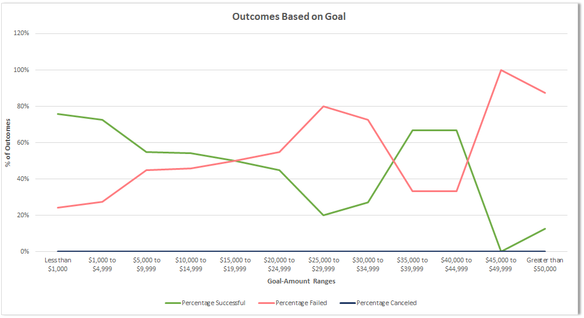

# A Kickstarter Campaign Analysis (using Excel)
---
## Overview of Project

In order to assist an up-and-coming playwright fund her play "Fever" through crowdfunding, the project aims to analyze Kickstarter data to determine if there are variables that make a play successful. 

### Purpose
Using Excel, the analysis brings in data related to Kickstarter campaigns and hones in on crowdfunding related to Theater. More specifically, campaigns related to plays, in order to help the playwright determine if "Fever" will be a success. Ultimately, the analysis should help the playwright decide if she should move forward to production.

## Analysis and Challenges
---
Looking at 4,114 different crowdfunding campaigns, 1,393 (34%) were related to Theater. Within the Theater category,
it consisted of 3 subcategory types: musical, plays, and spaces. 77% of the data was related to plays.
Since "Fever" falls under the subcategory of plays, the analysis looks at their outcomes based on two variables: Launch Date (time) and Goals (money). 

### Analysis of Outcomes Based on Launch Date (PART 1)
*How does time factor into a successful campaign?*
*Does launching at a particular time increase the chances for success?*

    1. Organizing/Sifting through the data
            Within the Kickstarter data, a unix timestamp indicated when the campaign was launched. 
            Using a conversion formula, the date was reformatted to show mm/dd/yyyy.

    2. Pivot tables and charts
            Pulling everything into a Pivot table, it filtered the data by the "Theater" parent category and years. 
            In addition, each date was grouped into their respective months (Jan-Dec). 
            Next, the outcomes were categorized into 3 columns: Successful, Failed, and Canceled.
            Live plays were omitted from the dataset.

The pivot chart reflects the outcomes of each theater campaign based on when the campaign was launched. 

***Observation:*** Here, it indicates that campaigns launched in late spring/early summer tend to be more successful than campaigns launch in the winter months.
It's evident that theater campaigns tend to have higher successful outcomes when launched in May/June. 

### Analysis of Outcomes Based on Goals (PART 2)
*Does the amount of the goal shape the outcome of the campaign?*

    1. Developing/Creating subset data
            When building the table, defined both columns and rows (different goal ranges were created that ranges up to $50K). 
            In order to populate the data table, used different formulas to pull in Kickstarter data in respective buckets.
            =COUNTIFS() fill in the number of plays that were successful, failed, or canceled based on goal amounts.
            Percentages are based on the number of campaigns to total (uses SUM() function at each goal range).

The line chart depicts the outcomes of plays based on the goal amount set for each campaign. 

***Observation:*** Here, it shows that a campaign has the highest rate of success when the goal is set to less than $1,000.
As the goal amount increases, the relationship between a successful and failed campaign become inverse. 
And, the highest rate of failure occurs at the $45,000 to $49,999 mark. This is also the range with a 0% success rate.
Interestingly, the success rate tends to rise as the goal nears the $35,000 mark.
But with only 6 projects within this goal-amount bracket, it's untelling whether these projects could be unique/outliers.
Overall, most successful campaigns tend to associate with lower goal amounts.

### Challenges and Difficulties Encountered

From a personal user experience, there were a few challenges encountered based on familiarity with Excel and its functions.

**PART 1:** In the Pivot table, understanding how to group your dates into months took some time to figure out. 
Eventually, I was able to navigate the sheet and find the option of grouping dates by years, quarters, months, or days. 

**PART 2:** As I walked through each step of this deliverable, I ran into a few complications. 
First, I tried to incorporate the `AND()` function into the formula when filtering for goal ranges. 
However, it wasn't working so I reverted to individually noting each criteria. 
Then I ran into errors where it wouldn't let me divide by zero (0), so I used the `=IFERROR()` function to fix it.
Then, after creating the table, my initial attempt at the graph did not match the expected outcome outlined. 
Double checking the formulas, they seemed to be working fine. It wasn't until I realized I didn't include the plays subcategory in my `=COUNTIFS()` formula.
Then, I came across some issues where a single space in my formula threw everything off. 
Moreover, by sitting with the data and finely tuning it, I was able to get a finalized graph that matched the anticipated outcome. 

## Results
---
*What are two conclusions you can draw about the Outcomes based on Launch Date?*
* The rate for successful campaigns tend to be higher when launched in May or June versus campaigns launched in December.
* The rate of failed campaigns tend to remain consistent month-to-month, with the exception of the spike in October. 

*What can you conclude about the Outcomes based on Goals?*
* Successful campaigns tend to have lower goal-amounts (particularly goal-amounts below $5,000).

*What are some limitations of this dataset?*
* Some limitations to the data is the source of the information and the accuracy of the sample size.
* The sample size for both variables wasn't enough. For example, when looking at time and assessing
which month is a predictor of success, I think it's important to know that not every year has each month accounted. 
Some years only have three months worth of data, whereas another year has 9, and only years 2015/2016 with the full 12 months.
I think even increasing the sample size for a particular year will be more telling if launch dates in a particular month are indicators of success. 

*What are some other possible tables and/or graphs that we could create?*
* With a dataset containing lots of valuable information, there are many was to cut/slice the information.
As noted above, I think it would help to look at outcomes based on the years. Are some years more successful than others? What are variables that could have impacted that year? 
For example, in 2020, a global pandemic - hence, it would be important to pick a year that is normalized.
And within that normalized year, obtain/increase the sample size, so we can hone back into which months are more telling of success.   
* In addition, the dataset accounted for multiple countries. I think it would be interesting to see if geographical locations are predictors for success. 
I think even filtering the data for where "Fever" was anticipated to be launched could also help with the decision and success prediction.
